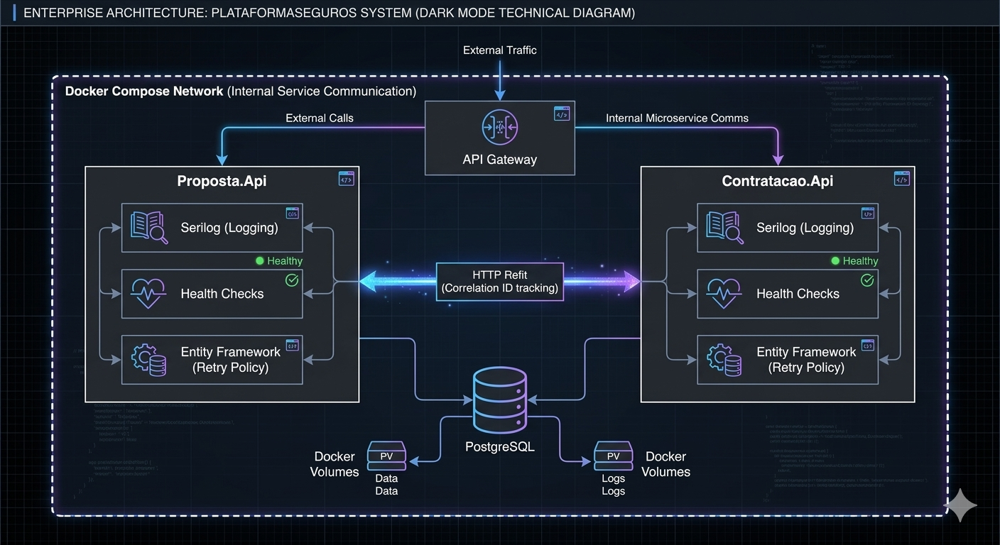
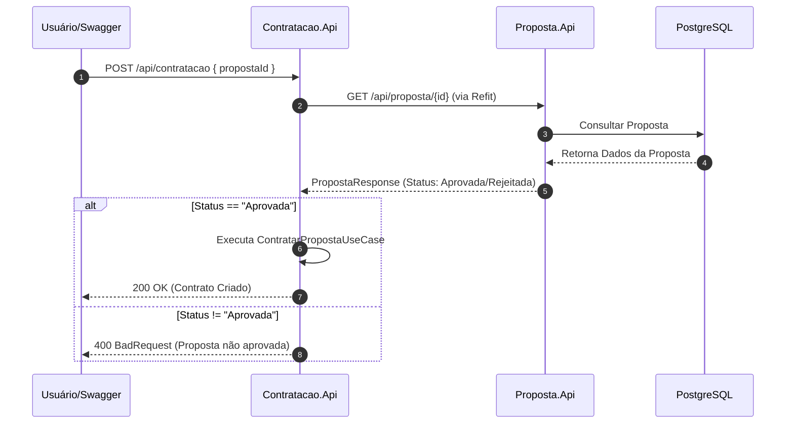

# PlataformaSeguros 🚀

Solução robusta desenvolvida em **.NET 8** utilizando **Arquitetura Hexagonal (Ports & Adapters)** para gestão de seguros, composta por dois microserviços resilientes:

*   **`PropostaService`**: Gerencia o ciclo de vida de propostas (Em Análise, Aprovada, Rejeitada).
*   **`ContratacaoService`**: Orquestra a formalização de contratos, integrando-se via HTTP (Refit) para validar o status da proposta antes da conclusão.

<!-- Seção do Diagrama Técnico -->
<div align="center">
  
  <p><i>Arquitetura de Solução: Foco em Resiliência e Observabilidade</i></p>
</div>

---
## 🏗️ Visão da Arquitetura

O projeto utiliza princípios de **Clean Architecture** e **Observabilidade**, garantindo rastreabilidade entre serviços através de `Correlation IDs` injetados em todos os logs.

### Estrutura de Pastas
```text
PlataformaSeguros/
├── Contratacao.Api/           # Primary Adapters (Controllers/Middlewares)
├── Contratacao.Application/   # Core Logic (Use Cases)
├── Contratacao.Domain/        # Domain Core (Entities/Ports/Value Objects)
├── Contratacao.Infrastructure/# Secondary Adapters (Repositories/Refit Clients)
└── Proposta.*                 # Estrutura espelhada para o serviço de Propostas
```

## 🔄 Fluxo de Contratação

O diagrama abaixo detalha a interação entre os serviços e a validação de regra de negócio:



## 🛠️ Como Executar

### Pré-requisitos
- Docker Desktop
- SDK do .NET 8 (opcional, para execução via CLI)

### Subir Ambiente (Full Stack)
O ambiente utiliza Resiliência de Inicialização. As APIs aguardam o PostgreSQL estar pronto através de uma política de retry antes de finalizar o startup.

```bash
docker-compose up -d --build
```

### Endereços de Acesso

| Serviço | URL | Descrição |
|--------|-----|----------|
| Swagger Proposta | http://localhost:5001/swagger | Documentação das Propostas |
| Swagger Contratação | http://localhost:5003/swagger | Documentação das Contratações |
| Health Check | /health | Verificação de integridade do serviço |

## 🛡️ Resiliência e Observabilidade

- **Auto-Migration**: O sistema aplica automaticamente as migrations do Entity Framework ao iniciar.
- **Connection Retry**: Implementado loop de 5 tentativas com intervalo de 3s no Program.cs para suportar o tempo de boot do PostgreSQL no Docker.
- **Correlation ID**: Todas as requisições geram um ID único que flui entre os microserviços, permitindo rastrear uma falha pontual em todo o ecossistema.
- **Logs Estruturados**: Configuração com Serilog para saída em console facilitando o monitoramento via container.

## 🧪 Qualidade e Suporte

### Executar Testes Unitários
Testes de lógica de domínio e casos de uso utilizando Moq e xUnit.

```bash
dotnet test
```

### Troubleshooting

**Reset Total do Ambiente**: Se houver erro de persistência ou volume corrompido:

```bash
docker-compose down -v
```

**Visualizar logs em tempo real**:
```bash
docker logs -f plataforma-seguros-proposta
```
